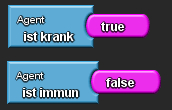
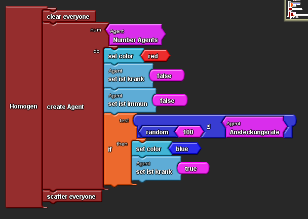
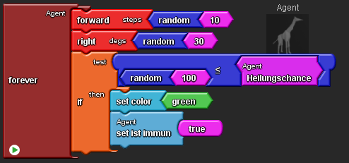
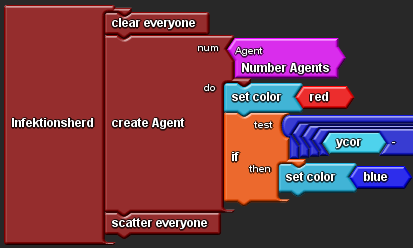
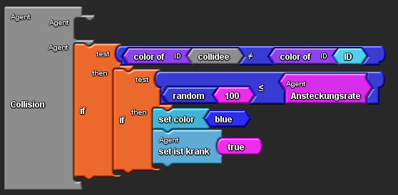
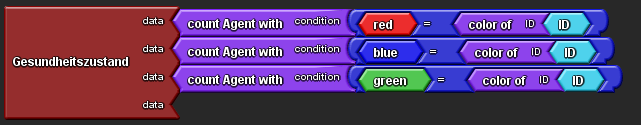
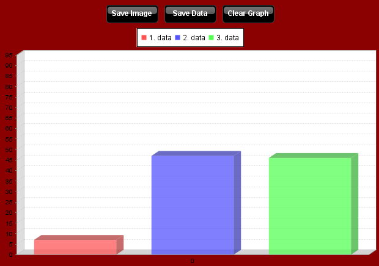

# Epidemie in Github Pages 

<h2><b> Gliederung</b> </h2>
<ul>
<li><a href="#Sta">1. StarLogoTNG</a></li>
<li><a href="#Hom">2. Homogene Epidemie</a></li>
<li><a href="#Inf">3. Infektionsherd</a></li>
<li><a href="#Ans">4. Ansteckungsrate</a></li>
<li><a href="#Imm">5. Immunität</a></li>
<li><a href="#Ges">6. Gesundheitszustand</a></li>
<li><a href="#Imp">7. Impressum</a></li>
</ul>

<h3> 
<a id="Sta">1. <b>StarLogoTNG</b> </a> 
</h3>

 StarLogoTNG ist ein Simulationsprogramm für die Blockprogrammiersprache.     
Es ist übersichtlich aufgebaut und besteht aus zwei Feldern, dem Programmierfeld und dem Spaceland, in denen man die Aktionen und Fortschritte der Agenten verfolgen kann. 

 Die Agenten können mehrere Formen annehmen und so individuell eingestellt werden.      
Auch die Umgebung kann durch Gebäude, Pflanzen und andere Gegenstände ergänzt werden.      
Durch das Zusammensetzen verschiedener Böcke, die in Ordnern am Rande des Programmierfeldes untergebracht sind, kann man die Agenten zu verschiedenen Handlungen bewegen.       
Diese Blöcke, welche man bei StarLogoTNG als "Variablen" bezeichnet, sind nach Verwendungszweck sortiert, zum Beispiel findet man Variablen für Gleichungssysteme im Ordner "math", der Ordner für Farben nennt sich "colors" etc. 

 Dadurch hat man also diverse Möglichkeiten, dem Spiel eine bestimmte Richtung zu geben. 

 Man kann also wie in unserem folgenden Projekt Epedemien mit Infektionsherden, Ansteckungen, Immunität und Gesundheitszuständen entstehen zu lassen, den Agenten bestimmte Aufgaben zu geben, wie etwa einen Baum in der Umgebung hochzuklettern, oder Unterhaltungen zwischen Agenten bei einer Kollision zu starten. 

 Zur vielfältigeren Gestaltung kann man die "Agenten" mischen und verschiedene Tiere und Farben einsetzen sowie im Spaceland die Sicht des Agenten und des Betrachters ein- und verstellen.     
Ebenfalls im Spaceland kann man bei Betätigung des "forever"- Buttons die aktuellen Änderungen sichern und die "Agenten" beliebig agieren lassen sowie die vorher im Programmierfeld eingestellten Aktionen beobachten und Verbesserungen vornehmen. 

 Fehler in der Programmierung machen sich also gleich bemerkbar, wenn sich im Spaceland keine Änderungen zeigen oder eine Variable nicht kompatibel für einen bestimmten Block ist. Durch dieses "Schlüssel-Schloss- Prinzip" ist das Programm für Anfänger geeignet und gut verständlich.   
Auch die gut sortierten Variablen und Ordner machen das Programmieren einfach. 

 Durch die vielen Gestaltungsmöglichkeiten ist StarLogoTNG sehr vielfältig nutzbar, wird aber nicht unübersichtlich, da das Programmierfeld am rechten oberen Rand nochmal in kleinerer Ausfühtung angezeigt wird, um den Überblick zu wahren, wenn die Variablen und Blöcke zu komplex werden. 
 

<h3>
<a id="Hom">2. <b>Homogene Epidemie</b> </a>
</h3>

 Um eine homogene Epidemie zu erstellen, muss man zunächst eine boolsche Agentenvariable für den Zustand "ist krank" und "ist immun" einrichten. 

 Als nächsten Schritt muss eine Ansteckungswahrscheinlichkeit festgelegt werden, nach der ein gewisser Prozentsatz der Population erkrankt sein soll.       
Dazu erstellt man einen "slider"- Block, mit dem wir die "Ansteckungsrate" festlegen können.  
Danach wird an den "slider"-Block die globale Variable "shared number" gesetzt und sie in "Ansteckungsrate" umbenannt.     
Der maximalen Wert muss dazu auf "100" angehoben werden.       
Im Kontrollzentrum des "Spaceland" kann man nun über einen Schieberegler die Ansteckungsrate einstellen. 

 Wie mit der Ansteckungsrate, sollte man mit der Anzahl der Giraffen, also der Populationsgröße fortfahren.     
Mithilfe eines "Slider"-Blocks und der Bedingung "Number Agents", wird die maximale Populationsgröße auf 100 Giraffen/"Agenten" gesetzt.   
Dafür fügt man an den "slider"-Block an die globale Variable "shared number" und benennt sie in "Number Agents" um.       
Wie die Ansteckungsrate kann die Populationsgröße im Kontrollzentrum des "Spaceland" eingestellt werden. 

 Nun kann mit der Programmierung der homogen verteilten Epidemie begonnen werden.      
Hierzu erstellt man zunächst einen "setup"-Block, der in "Homogen" umbenannt wird.      
Damit bei jedem Neustart mit einer neuen Population begonnen werden kann, setzt man zuerst den Befehl 
"clear everyone" ein.     
Somit wird bei jedem Neustart über den "Homogen"-"setup"-Block im Kontrollzentrum die alte Population gelöscht.  
Als Nächstes ist es sinnvoll,  einen "create Agent-number-do"-Block einzusetzten.      
Über das "number"-Feld wird die Größe der kreierten "Agenten" eingestellt.      
Dazu setzen wir den "number Agents"-Block ein, bei dem die Anzahl über den Schieberegler im "Spaceland" eingestellt wird.      
In dem "do"-Feld verwendet man zuerst den Befehl "set color"-"red" ein, damit alle gesunden "Agenten" die Farbe rot annehmen.      
Danach werden die Befehle "set ist krank"-"false" und "set ist immun"-"false" eingesetzt, um die boolschen Agentenvariabeln zu initialisieren.        
Denn diese sollen für die gesunden/roten "Agenten" als falsch eingestellt sein.    
Damit ein bestimmter Prozentsatz, homogen über die Population verteilt, krank werden kann, wird eine "if-test-then"-Block eingestezt. 

 In die "test"-Spalte wird die Bedingung "random"-"100" "ist kleiner oder gleich" "Ansteckungsrate" eingefügt.     
In die "then"-Spalte setzt man den Befehl "set color"-"blue" und die boolsche Agentenvariabel mit "set ist krank"-"true" auf "wahr".        
Wenn also die Bedingung in der "test"-Spalte zutrifft wird der Agent krank/blau. 

 

 Damit sich die Krankheit ausbreiten kann, erstellt man einen "forever"-Block und setzt einen Befehl für die Bewegung nach Vorne mit 1 bis 10 Schritten durch "forward"-"random"-"10" ein.      
Für die Drehung nach rechts in einem Winkel von 1-30 Grad wird der Befehl "right"-"random"-"30" eingefügt. 

<h3> 
<a id="Inf">3. <b>Infektionsherd</b> </a>
</h3>

 Um einen Agenten die Epedemie auslösen zu lassen, wird  ein Infektionsherd gebraucht.   
Zuerst erstellt man einen neuen Block, der "Infektionsherd" genannt wird und fügt die Variablen "clear everyone" hinzu, um mit einer neuen Population bei einem Neustart beginnen zu können. 

 Danach setzt man unter diese Variable den Block "create agent", um den Auslöser der Epidemie zu kreieren.
Zu diesem Block kamen die Variablen "number Agent", damit wie bei der homogenen Epidemie die Anzahl der Agenten im Spaceland eingestellt werden kann.  
Dazu setzt man mit "set color"-"red" die Farbe der gesunden Agenten auf rot. 

 Außerdem war ein "if then test"- Block nötig, da die Farbe sich bei einer Ensteckung ändern sollte. 

 Nachdem  dies getan ist, erstellt man eine lange Variable nach Vorlage des des Satzes des Pythagoras.
Sie bewirkt, dass sich nur die Agenten infizieren, die sich in einem bestimmten Bereich des "Spaceland" aufhalten. 

 Dies geschieht in Verbindung mit der Ansteckungsrate, welche im Spaceland variabel verwendet werden kann. Wie diese Kollision zu programmieren ist, wird im nächsten Schritt noch genauer beschrieben. 

<h3>
<a id="Ans">4. <b>Ansteckung</b> </a>
</h3>

 Um sich gegenseitig anstecken zu können, müssen sich ein kranker und ein gesunder "Agent" begegnen.     
Man muss dafür einen "Collisions"-Blog für eine Kollision zwischen zwei Agenten verwenden.     
Um eine Bedingung für die Ansteckung einstellen zu können, setzt man einen "if-test-then"-Block in eine freies Feld des "Collision"-Blocks.       
Da sich nur "Agenten" unterschiedlicher Farbe, also unterschiedlicher Gesundheitszustände, anstecken sollen, setzt man in das "test"-Feld die Bedingung "color of ID"-"collidee" "ungleich" "color of ID"-"ID".      
Als nächstes sollen sich die "Agenten" nur zu einer bestimmten Wahrscheinlichket anstecken. Also setzt man einen weiteren "if-test-then"-Block in die "test"-Spalte des anderen "if-test-then"-Blocks.     
In die "test"-Spalte wird die Bedingung "random"-"100" "ist kleiner oder gleich" "Ansteckungsrate" eingefügt.  
Somit erhält man eine Ansteckunswahrscheinlichkeit in Prozent.   
Trifft diese Bedingung zu, soll der "Agent" erkranken.   
Also setzt man in die "then"-Spalte den Befehl "set color"-blue" und die boolsche Agentenvariable "ist krank" mit "set ist krank" auf "true". 

 Die Ansteckungsrate ist mit einem "slider"-Block im Kontrollzentrum des "Spaceland" durch einen Schieberegler einstellbar.   
Dafür schließt man an den "slider"-Block die globale Variable "shared number" an und benennt sie in "Ansteckungsrate" um. 

<h3> 
<a id="Imm">5. <b>Immunität</b> </a>
</h3>

 Um eine Immunität einrichten zu können, muss eine boolsche Agentenvariable für den Zustand "ist immun" erstellt werden. 

 Die kranken Agenten sollen nach einiger Zeit zu einer bestimmten Wahrscheinlickeit wieder gesund werden.   
Daraufhin sollen sie immun sein.     
Dazu muss in den "forever"-Block ein "if-test-then"-Block eingesetzt werden.      
In die "test"-Spalte setzt man die Bedingung "random"-"100" "ist kleiner oder gleich" "Heilingschance".    
Trifft dieser ZUstand bei einem "Agenten" ein, soll er die Befehle aus der "then"-Spalte ausführen.   
Diese wären:   
"Set color"-"green" und "set ist immun"-"true".  
Er soll also die Farbe "grün" für immun annehmen, weshalb wir die boolsche Agentenvariable für "ist immun" auf "true" eingestellt haben. 

 Die Heilungschance soll wieder mit einem Schieberegler im Spacland einstellbar sein.   
Hierzu erstellt man einen "slider"-Block für die Heilunschance und setzt wieder den maximalen Wert auf "100".   
Dafür fügt man an den "slider"-Block die globale Variable "shared number" hinzu und benennt sie in "Heilungschance" um. 

<h3>
<a id="Ges">6. <b>Gesundheitszustand</b>  </a>
</h3>

 Die "Agenten" in der Epidemie-Simulation nehmen nun nach und nach unterschiedliche Farben an (rot, blau, grün).
Damit die Verteilung der unterschiedlichen Gesundheitszustände (Gesund, Krank, Immun) auf einen Blick dargestellt wird, ist es sinnvoll, ein Säulendiagramm zu erstellen, in dem die unterschiedlichen Mengen der Gesundheitszustände mittels Säulen
in den entsprechenden Farben abgelesen werden können.     
Hierzu muss zunächst ein "bar graph"-Block erstellt werden, der zuerst in "Gesundheitszustand" umbenannt wird.   
In die offenen "socks" kann nun die Bedingungen für die einzelnen Säulen eingegeben werden.  
Dazu wird zuerst die Säule erstellt, die die Menge der gesunden "Agenten" angibt.    
Dafür setzt man an den "Gesundheitszustand"-Block den Befehl "count Agent with" an. 
Die Bedingung sollte in diesem Fall sein:   
"color red" "=" "color of ID"-"ID". Die Farbe des Agenten sollte also der Farbe "rot" entsprechen, um in dieser Säule gezählt zu werden.    
Ähnlich fährt man bei den weiteren freien Feldern des "Gesundheitszustand"-Blocks fort.    
Man setzt wieder den Befehl "count Agent with" ein.     
In dieser Säule soll aber die Anzahl der kranken "Agenten" dargestellt werden.   
Hierzu wird als Bedingung "blue" "=" "color of ID"-"ID" eingesetzt.      
Für die immunen Agenten fährt man genau so fort, setzt jedoch als Bedingung "green" "=" "color of ID"-"ID" ein.     
Nun kann man zu Beginn der Simulation und im laufe der Simulation die Anzahl der gesunden, kranken und immunen Agenten im "Kontrollzentrum" des "Spaceland" ablesen.     
Durch Anklicken der Grafik kann der Zahlenbereich der Y- bzw. X-Achse abgelesen werden. 

 Startet man die Simulation einer homogenen Epidemie sieht das Bild mit den 

gesunden (rot)
 

 kranken (blau)

immunen (grün)
 
"Agenten" im "Spaceland" so aus: 

<h3>
<a id="Imp">7. <b>Impressum</b> </a> 
</h3>

<table>
<thead>
<tr>
<th>Name</th>
<th align="center">Klasse</th>
<th align="center">Schule</th>
<th align="center">Link</th>
</tr>
</thead>
<tbody>
<tr>
<td><i>Antonia Heitmann</i></td>
<td align="center"><i>12a</i></td>
<td align="center"><i>Stormarnschule Ahrensburg</i></td>
<td align="center"><a href="http://stormarnschule.de/">Stormarnschule </a></td>
</tr>
<tr>
<td><i>Theresa Daniel</i></td>
<td align="center"><i>12a</i></td>
<td align="center"><i>Stormarnschule Ahrensburg</i></td>
<td align="center"><a href="http://stormarnschule.de/">Stormarnschule</a></td>
</tr>
